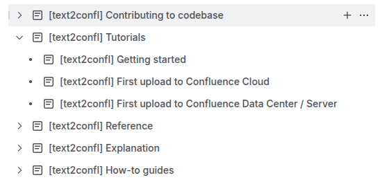

# text2confl

<!-- Keep badges minimal and actionable. -->
[](https://hub.docker.com/r/zeldigas/text2confl)
[](https://hub.docker.com/r/zeldigas/text2confl)
[](https://github.com/zeldigas/text2confl/releases/latest)
[](LICENSE)
[](https://github.com/zeldigas/text2confl/actions/workflows/build.yml)

Publish docs written in structured text formats (Markdown, AsciiDoc) to Confluence (Server/DC and Cloud).

## If this project helps you

Please :star: **star this repo** — it helps other people discover the tool and motivates further maintenance.

## Why text2confl

`text2confl` focuses on turning docs-as-code (or any structured text) into a Confluence page tree:

- Works with **Confluence Cloud** and **Confluence Server/Data Center**
- Supports **Markdown** and **AsciiDoc** (and lets you mix formats in one documentation set)
- Tries to provide **good feature coverage** for the chosen markup language, mapped to Confluence capabilities
- Supports **extensibility/customization** (e.g., adding macros) so you don’t need to fork for common needs

## Documentation

**New to text2confl?** Start with the first upload guide for your deployment:

- :rocket: [Confluence Cloud](docs/tutorials/first-upload-cloud.adoc) — `yoursite.atlassian.net`
- :rocket: [Confluence Data Center / Server](docs/tutorials/first-upload-dc.adoc) — self-hosted

**Doing a specific task?** See the how-to guides:

- :lock: [Authenticate with Confluence](docs/how-to/authenticate.md)
- :arrow_up: [Upload docs](docs/how-to/upload-docs.md) · [Ad-hoc upload](docs/how-to/upload-adhoc.md) · [Run with Docker](docs/how-to/run-with-docker.md)
- :arrow_down: [Export a Confluence page to Markdown](docs/how-to/export-to-markdown.md)
- :file_folder: [Use virtual pages](docs/how-to/use-virtual-pages.md) · [Manage orphaned pages](docs/how-to/manage-orphaned-pages.md)
- :office: [Configure multi-tenancy](docs/how-to/configure-multi-tenancy.md)

**Looking up options?** See the reference:

- :gear: [Configuration reference](docs/reference/configuration.md)
- :memo: [Markdown syntax](docs/reference/markdown.md) · :scroll: [AsciiDoc syntax](docs/reference/asciidoc.adoc)
- :page_facing_up: [Page attributes](docs/reference/page-attributes.md) · [Image attributes](docs/reference/image-attributes.md) · [Code blocks](docs/reference/code-blocks.md)

**Want to understand how it works?** See the explanations:

- :mag: [How publishing works](docs/explanation/how-publishing-works.md)
- :books: [Storage formats](docs/explanation/storage-formats.md) — Markdown vs AsciiDoc
- :brain: [Change detection strategies](docs/explanation/change-detection.md)

Contributing:

- :handshake: [Contributing guide](CONTRIBUTING.md)
- :construction: [Contribution notes](docs/contributing.md)

## Try it with this repo’s docs

You can publish text2confl’s own documentation to your Confluence to see the tool in action.
Pick a space and a parent page under which the pages will be created:

```shell
# from the root of the checked out text2confl repo
text2confl upload --docs ./docs \
  --confluence-url https://wiki.example.org \
  --user bob \
  --password secret_password \
  --space DOCS \
  --parent "Text2Confl test"
```

Example resulting page tree:



**Note on a public docs showcase:** At the moment there is no public Confluence demo because Confluence Cloud free tier
doesn’t allow publishing spaces/pages to non-members. If you’d like to sponsor a public demo space or provide access for
a read-only showcase, please open an issue.

## Who’s using text2confl

If your team uses `text2confl`, consider adding your company/project name here. It helps show that the tool is used in real setups.

- _Your company / project_

To get listed, open a PR that adds a bullet to this section. If you prefer not to do that publicly, you can also open an issue/PM to me and I’ll add it for you.

## Scope

`text2confl` does not assume the purpose of the publishing process or the type of content you are going to upload.
It can be formal docs managed as code, a to-do list, or a report generated from Jira.

Because of that there isn’t a strict “final” feature set. If you find something missing, please create an issue and
describe your needs.

## Design and usability goals

Key principles the tool tries to follow:

1. Provide good feature coverage for every supported source format. If you pick AsciiDoc, it should feel comfortable,
   not like you constantly hit unsupported features.

   _Note:_ features still need to map to Confluence formatting or macros.
2. Provide reasonable defaults and auto-detection where possible (e.g., Cloud vs Server editor differences).
3. Support both Confluence Server/Data Center and Cloud and be aware of differences in editors/features.
4. If the source format supports extensibility/customization, support it. There should be no need to fork just to add
   common macros.

## Supported source formats

- ✅ Markdown
- ✅ AsciiDoc
