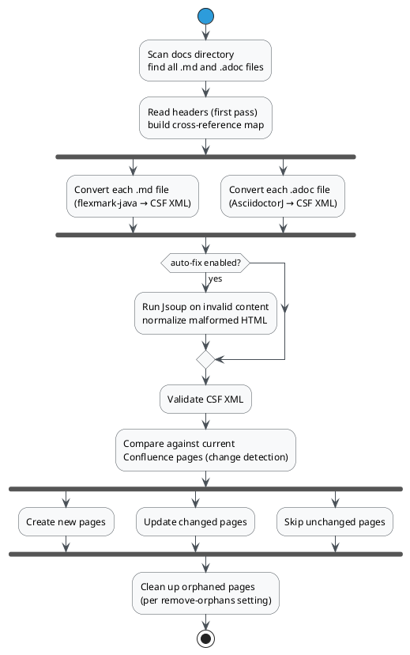

# How publishing works

This page explains the internal pipeline text2confl follows when you run `upload` or `convert`. Understanding it helps you reason about unexpected behavior and make better configuration decisions.

## Overview

## Step 1 — File scanning

text2confl scans the documentation root recursively using the following rules:

1. A file is included if it has a supported extension (`.md`, `.adoc`) and its name does **not** start with `_`. Files starting with `_` are private assets (e.g. `_assets/` directories, included files not meant to be published on their own).
2. A file `foo.md` and a directory `foo/` at the same level form a parent-child relationship: `foo.md` becomes the Confluence page, and all files inside `foo/` become its children. This is how the file tree maps to the Confluence page hierarchy.
3. If a directory `foo/` exists but `foo.md` does not, the directory's contents are skipped entirely.

## Step 2 — Header reading (first pass)

Before conversion, text2confl reads the header (front matter for Markdown, document attributes for AsciiDoc) from every file in the tree. This builds a **reference map**: a lookup table from file path to page title. The reference map is needed to resolve cross-links during conversion — when a Markdown link like `[see here](./other-page.md)` is encountered, text2confl looks up the target's Confluence page title to emit the correct Confluence Storage Format cross-reference.

Duplicate page titles are detected at this stage and cause an error before any conversion begins. Confluence has a flat title namespace per space, so every published page must have a unique title.

## Step 3 — Conversion

Each file is converted by the appropriate converter based on its extension:

**Markdown** files go through [flexmark-java](https://github.com/vsch/flexmark-java). flexmark parses the source into an AST, then a set of custom visitors walks the AST and emits Confluence Storage Format (CSF) XML. Confluence-specific features (admonitions, status macros, Confluence macros) are implemented as flexmark extensions that hook into this visitor chain.

**AsciiDoc** files go through [AsciidoctorJ](https://github.com/asciidoctor/asciidoctorj). Instead of a custom visitor, text2confl uses a custom Asciidoctor backend: a set of [Slim](https://slim-template.github.io/) templates that replace Asciidoctor's default HTML output templates and emit CSF XML directly. Diagrams are handled by `asciidoctor-diagram` or `asciidoctor-kroki` extensions that run during Asciidoctor's processing phase.

Both paths produce a `PageContent` object containing the CSF XML body and a list of attachments (files to be uploaded alongside the page).

## Step 4 — Optional: auto-fix

If `auto-fix-content-tags: true` is configured, text2confl runs the converted body through [Jsoup](https://jsoup.org/) when XML validation fails. Jsoup's tolerant HTML parser normalizes misnested or unclosed tags, producing well-formed XML. See [Content auto-fix](./auto-fix-content.md) for the tradeoffs.

## Step 5 — XML validation

text2confl validates the CSF XML before any network calls. This catches converter bugs and malformed raw HTML snippets early, giving a clear error message pointing to the problematic file rather than a cryptic Confluence API error.

## Step 6 — Change detection

For each page, text2confl compares the converted content against the current state in Confluence to decide whether an upload is needed. Two strategies are available (`hash` and `content`). See [Change detection strategies](./change-detection.md) for details.

Pages that haven't changed are skipped entirely — no API calls are made for them.

## Step 7 — Upload

Pages are created or updated via the Confluence REST API. Attachments are uploaded alongside their parent page. The autogenerated note (pointing to the source file) is prepended to the page body if `docs-location` is configured.

Page identity is tracked by page title. If a page's title changes (e.g. you rename the heading in a Markdown file), text2confl creates a new page and the old one becomes an orphan.

## Step 8 — Orphan cleanup

After all uploads complete, text2confl identifies pages that were previously part of the document tree but are no longer present. What happens to them depends on the `remove-orphans` setting. See [Manage orphaned pages](../how-to/manage-orphaned-pages.md).

## Managed pages

A page is "managed" if it was last written by text2confl. text2confl stores a marker in Confluence page metadata during upload. This marker is used by the orphan cleanup logic (to distinguish text2confl-owned pages from manually-created ones) and by the multi-tenancy feature (to identify which team owns a page).

## See also

- [Storage formats](./storage-formats.md) — more on the Markdown and AsciiDoc conversion pipelines
- [Change detection strategies](./change-detection.md)
- [Content auto-fix](./auto-fix-content.md)
- [Manage orphaned pages](../how-to/manage-orphaned-pages.md)
